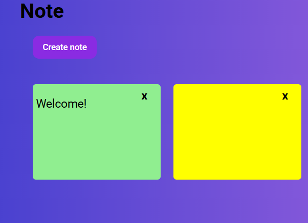

# note

Simple note made with HTML, CSS, and JavaScript.

##  Project Tutorial

This project was created for learning purposes by following a tutorial by [GreatStack](https://www.youtube.com/@GreatStackDev):

➡️ [How To Build Notes App Using HTML CSS and JavaScript](https://www.youtube.com/watch?v=n3U4jFbp05M&t=509s)

---

## Live Demo

👉 [View Live Demo](https://imileskiene.github.io/note/)  

---

## Technologies Used

- HTML
- CSS
- JavaScript

---

## Screenshot

---

## 📄 License

This project is intended for educational purposes only.
